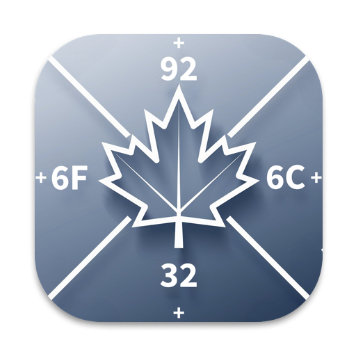

# MAPLE
MAPLE or **M**eaningful **A**daptations of **P**lus-code **L**ocations for **E**veryone, is an encoder for Plus Codes that takes any level 6 Plus Code or 12 character long Plus Codes and encodes them into 4 english words, similar to what3words.

## Users
The MAPLE prefix to be used in a navigation service is:
```
MAPLE//WORD1-WORD2-WORD3-WORD4
```

## Devs
For each language, there is a corrasponding directory. Each directory has a ```devs.md```, those files will give you details on how to properly integrate MAPLE into your code.

## Support
For questions open a discussion.

For support, reports, or requests open an issue.

## Contributing
Fork the ``dev`` branch.

Make your changes in your fork. MAKE SURE YOU WRITE A DEVS.MD IF NEEDED. You can use serve.py if working in the web.

Fill out the pull request form.

Open a pull request.

## License
This project is licensed under the GPL-3.0 license.

You may:
- Modify and redistribute the code,
- Only if you keep it open-source and GPL-licensed,
- Provide credit to the original author (JEMcats-Software).

No closed-source forks or redistributions allowed.

## Credits

- [Google Plus Codes](https://github.com/google/open-location-code/) (The provider of Plus Codes to be encoded)